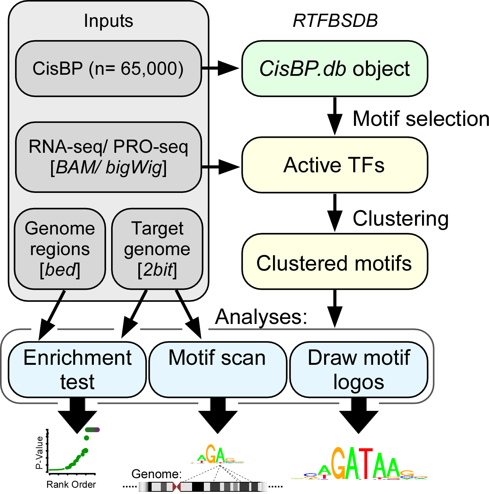

rtfbs_db
========

Transcription factors (TFs) regulate complex programs of gene transcription by binding to short DNA sequence motifs. Here we introduce rtfbsdb, a unified framework that integrates a database of more than 65,000 TF binding motifs with tools to easily and efficiently scan target genome sequences. Rtfbsdb clusters motifs with similar DNA sequence specificities and optionally integrates RNA-seq or PRO-seq data to restrict analyses to motifs recognized by TFs expressed in the cell type of interest.  Our package allows common analyses to be performed rapidly in an integrated environment.  

Uses: Parse TF motifs from public databases, read into R, and scan using 'rtfbs'.

Sources of Position Weight Matrices (PWMs).
-------------------------------------------

* CIS-BP: http://cisbp.ccbr.utoronto.ca/bulk.php
	Weirauch MT, et. al. Determination and inference of eukaryotic transcription factor sequence specificity. Cell. 2014 Sep 11;158(6):1431-43. doi: 10.1016/j.cell.2014.08.009.

* Jolma: Downloaded from the supplementary data of this paper: http://www.nature.com/nature/journal/vaop/ncurrent/full/nature15518.html
	Jolma A, et. al. DNA-dependent formation of transcription factor pairs alters their binding specificity.  Nature.  2015 Nov 19;527(7578):384-8.

* Jolma: Downloaded from the supplementary data of this paper: http://www.cell.com/retrieve/pii/S0092867412014961
	Jolma A, et. al.  DNA-binding specificities of human transcription factors. Cell. 2013 Jan 17;152(1-2):327-39. doi: 10.1016/j.cell.2012.12.009. 

* Jaspar: http://129.177.120.189/cgi-bin/jaspar2010/jaspar_db.pl
	Mathelier A, et. al. JASPAR 2014: an extensively expanded and updated open-access database of transcription factor binding profiles. Nucleic Acids Res. 2014 Jan 1;42(1):D142-7. doi: 10.1093/nar/gkt997. Epub 2013 Nov 4.

* HOCOMOCO: http://hocomoco.autosome.ru/
	Kulakovskiy IV, et. al. HOCOMOCO: a comprehensive collection of human transcription factor binding sites models. Nucleic Acids Res. 2013 Jan;41(Database issue):D195-202. doi: 10.1093/nar/gks1089. Epub 2012 Nov 21.

* Neph: URL: ftp://ftp.ebi.ac.uk/pub/databases/ensembl/encode/supplementary/integration_data_jan2011/byDataType/footprints/jan2011/de.novo.pwm 
	Neph S, et. al. An expansive human regulatory lexicon encoded in transcription factor footprints. Nature. 2012 Sep 6;489(7414):83-90. doi: 10.1038/nature11212.

* UniProbe: http://the_brain.bwh.harvard.edu/uniprobe/
	References: http://the_brain.bwh.harvard.edu/uniprobe/references.php

Requires
--------

* rtfbs: In R, type: "install.packages('rtfbs')"

* bedops:
	* Get the latest version of the bedops binaries here: https://bedops.readthedocs.org/en/latest/
	* Install, and add them to your path.

* The twoBitToFa program from the Kent libraries.  Download it here: http://hgdownload.cse.ucsc.edu/admin/exe/

* 2bit files for your genome of interest.  Find links to these here: http://hgdownload.cse.ucsc.edu/downloads.html

* For more information about the installation, please check the [tutorial document](https://github.com/Danko-Lab/rtfbs_db/blob/master/rtfbsdb-tutorial.pptx) (Page 9 in 'rtfbsdb-tutorial.pptx').

Documents
----------
* Totorial, including installation and usage. 
https://github.com/Danko-Lab/rtfbs_db/blob/master/rtfbsdb-tutorial.pptx

* R vignette:
https://github.com/Danko-Lab/rtfbs_db/blob/master/rtfbsdb-vignette.pdf

* R manual:
https://github.com/Danko-Lab/rtfbs_db/blob/master/rtfbsdb-manual.pdf 	

How to cite?
-----------

* Wang, Z., Martins, A. L., & Danko, C. G. (2016). [RTFBSDB: an integrated framework for transcription factor binding site analysis.](https://doi.org/10.1093/bioinformatics/btw338) Bioinformatics, 32(19), 3024-3026.

